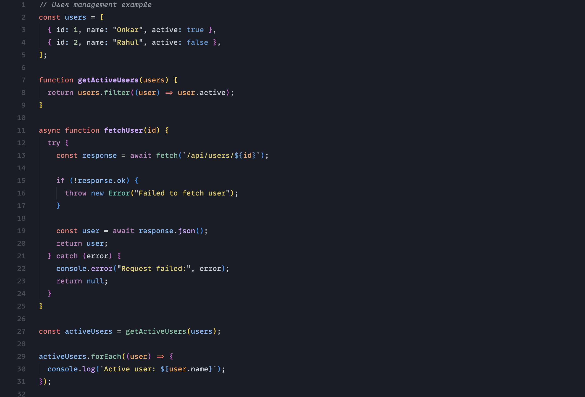
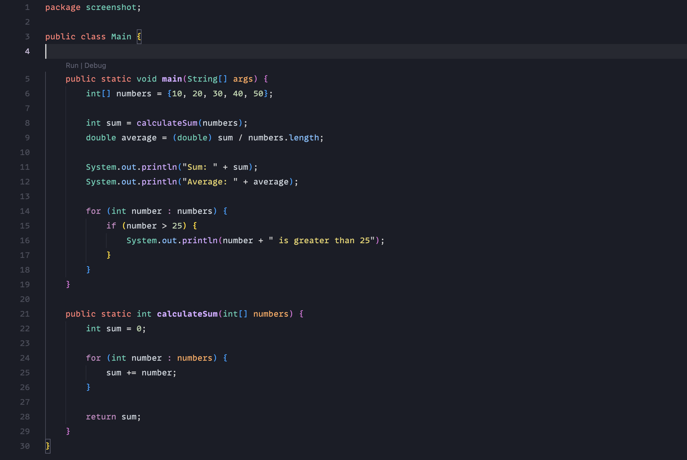
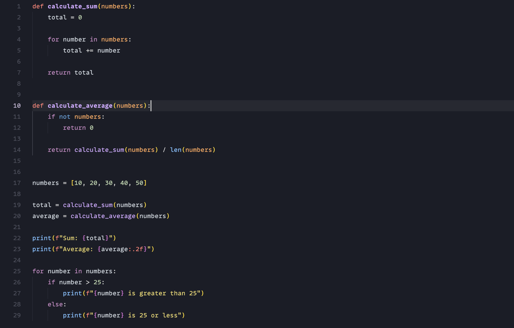
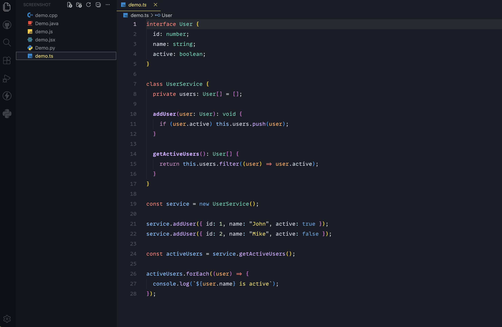
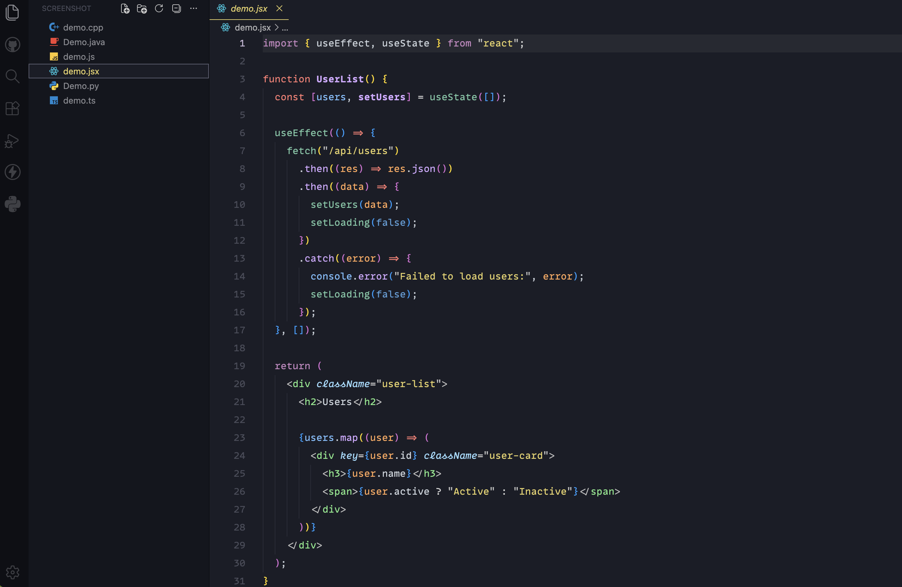
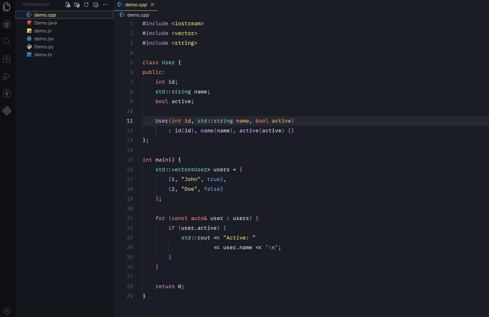

# 🖍️ Crayon Theme

<p align="center">
  <a href="https://marketplace.visualstudio.com/items?itemName=OnkarChougule99.crayon-theme">
    
  </a>
  <a href="https://marketplace.visualstudio.com/items?itemName=OnkarChougule99.crayon-theme">
    
  </a>
  <a href="https://marketplace.visualstudio.com/items?itemName=OnkarChougule99.crayon-theme">
    
  </a>
  <a href="https://github.com/Trampoline999/Crayon/releases">
    
  </a>
  <a href="LICENSE">
    
  </a>
</p>

> A modern, vibrant, and eye-comforting dark color theme crafted for developers who value clarity, aesthetic elegance, and long hours of fatigue-free coding.

---

## 🌟 About Crayon

**Crayon** brings a vibrant, eye-comforting dark theme to Visual Studio Code. Inspired by the rich tones of artist crayons, it pairs a glare-free dark canvas with lively pastel and neon accents—carefully calibrated for effortless readability and fatigue-free coding.

---

## ✨ Features & Highlights

- 🎨 **Artistic & Cohesive Palette**: Vivid shades of mint greens, soft lilacs, electric cyans, warm corals, and buttery yellows that look stunning together.
- 👁️ **Engineered for Eye Comfort**: Uses a balanced dark slate backdrop that prevents screen glare and reduces eye strain during late-night development sprints.
- 🧠 **Rich Semantic Highlighting**: Full support for VS Code's modern semantic token engine, distinguishing variables, declarations, methods, parameters, and classes with precision.
- 🛠️ **Seamless Full-UI Coverage**: Not just an editor theme—the sidebar, status bar, activity bar, terminal, tabs, git diffs, and breadcrumbs are styled with consistent polish.
- 🌐 **Multi-Language Perfection**: Fine-tuned syntax rules for **JavaScript**, **TypeScript**, **Python**, **React (JSX/TSX)**, **Java**, **C/C++**, **Go**, **Rust**, **HTML/CSS**, **JSON**, **Markdown**, and more.

---

## 📸 Screenshots

### JavaScript


### Java


### Python


### TypeScript


### React


### C++


---

## ⚙️ Recommended Settings

For the best visual experience matching the screenshots, add the following configuration to your VS Code `settings.json`:

```json
{
  "editor.fontSize": 14,
  "editor.lineHeight": 26,
  "editor.fontLigatures": true,
  "editor.fontFamily": "'MonoLisaCode', 'JetBrains Mono', 'Fira Code', 'Cascadia Code', Menlo, Consolas, monospace",
  "editor.fontWeight": "normal"
}
```

---

## 🚀 Usage / Installation

### Method 1: Local Development / Testing
1. Press `F5` in VS Code to launch an Extension Development Host window with this theme loaded.
2. Open the Command Palette (`Cmd+Shift+P` on macOS or `Ctrl+Shift+P` on Windows/Linux).
3. Type **Preferences: Color Theme** and select **Crayon**.

### Method 2: Install Locally in VS Code
Copy or symlink this folder to your VS Code extensions directory:
- **macOS / Linux**: `~/.vscode/extensions/crayon-theme`
- **Windows**: `%USERPROFILE%\.vscode\extensions\crayon-theme`

```bash
# Example on macOS:
cp -r "/Users/onkarchougule/Desktop/Dark Theme" ~/.vscode/extensions/crayon-theme
```
Restart VS Code, then select **Crayon** from your Color Themes list.

### Method 3: Package as VSIX
If you have `@vscode/vsce` installed:
```bash
npx @vscode/vsce package
```
Then install the generated `.vsix` file in VS Code (`Extensions` > `...` > `Install from VSIX...`).

---

## 🤝 Contributing & Feedback

Suggestions, bug reports, and pull requests are warmly welcome! If you notice any language tokens that need tuning, feel free to open an issue or submit a PR on [GitHub](https://github.com/Trampoline999/Crayon).

---

## 📄 License

This project is licensed under the [MIT License](LICENSE).


